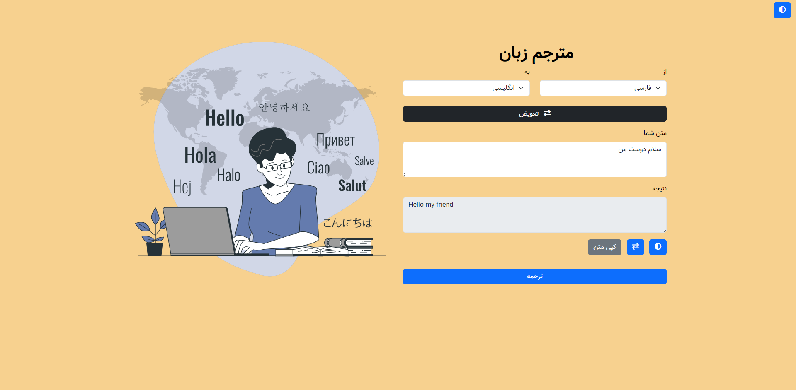

# Real-Time Translator Website

A sleek and user-friendly real-time translator website supporting 14 languages, with the ability to add more languages easily. Built using HTML, CSS, JavaScript, and PHP.

## Features

- Real-time translation between 14 languages
- Easy addition of new languages
- Modern and responsive design
- Built with HTML, CSS, JavaScript, and PHP

## Preview

## Contribution

If you would like to contribute to the enhancement and improvement of this project, please send a pull request. You can also report issues through the issue tracker.

## Contact

<a href="https://t.me/LampStack">Telegram</a> 
<a href="mailto:xialop@outlook.com">Email</a>

## License

This project is released under the [MIT License](LICENSE)
